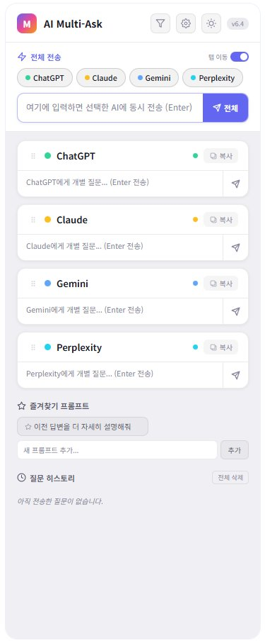
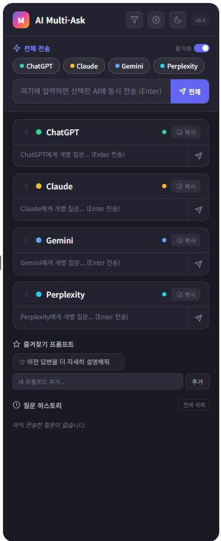

# AI Multi-Ask

  

  <strong>ChatGPT, Claude, Gemini, Perplexity 4개 AI에 동시 질문 & 응답 비교</strong> 
  크롬 사이드패널에서 여러 AI에 한번에 질문을 보내고, 빠르게 응답을 비교할 수 있는 확장 프로그램

---

## 스크린샷

| 라이트 모드 | 다크 모드 |
|:-:|:-:|
|  |  |

## 기능

### 전송
- 선택한 AI에 한번에 질문 전송
- 각 AI에 개별 질문 가능
- AI 탭이 없으면 자동으로 사이트를 열고 전송
- 전송 실패 시 자동 새로고침 후 재전송

### 탭 관리
- 카드 클릭으로 해당 AI 탭으로 이동
- 개별 전송 시 자동 탭 이동 (토글 가능)
- 각 AI 탭 열림 상태 실시간 표시

### 응답 복사
- 각 AI의 마지막 응답을 클립보드에 복사

### 필터
- 사용할 AI만 선택하여 표시

### 카드 정렬
- 드래그 & 드롭으로 AI 카드 순서 변경

### 시스템 프롬프트
- 전체 모드: 모든 AI에 동일한 역할 설정
- AI별 모드: 각 AI마다 다른 역할 설정
- 프리셋 제공 (번역가, 개발자, 쉬운 설명, 간결 모드)

### 즐겨찾기 프롬프트
- 자주 쓰는 프롬프트 저장 후 클릭으로 입력

### 질문 히스토리
- 최근 질문 기록 저장, 클릭으로 재사용

### 다크/라이트 모드
- 수동 전환 가능, 기본값은 시스템 설정

## 설치

### 크롬 웹스토어
> 준비 중

### 수동 설치
1. 이 레포를 클론 또는 ZIP 다운로드
2. `chrome://extensions` 접속
3. 우측 상단 **개발자 모드** 활성화
4. **압축해제된 확장 프로그램을 로드합니다** 클릭
5. 다운로드한 폴더 선택
6. 크롬 우측 사이드패널에서 AI Multi-Ask 선택

## 지원 AI

| AI | URL |
|---|---|
| ChatGPT | chatgpt.com |
| Claude | claude.ai |
| Gemini | gemini.google.com |
| Perplexity | perplexity.ai |

## 기술 스택

- Chrome Extension Manifest V3
- Side Panel API
- Chrome Scripting API (MAIN world)
- Vanilla JavaScript
- CSS Custom Properties

## 라이선스

MIT License